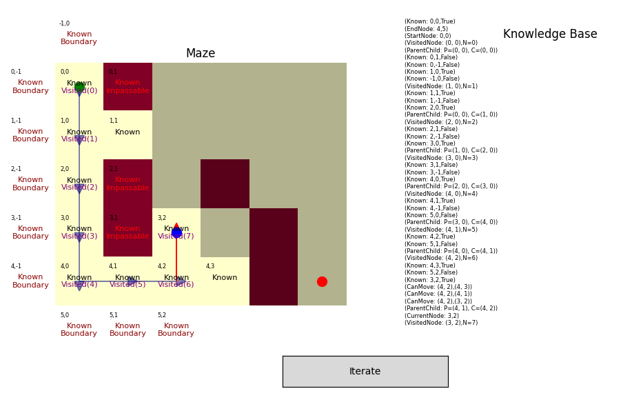
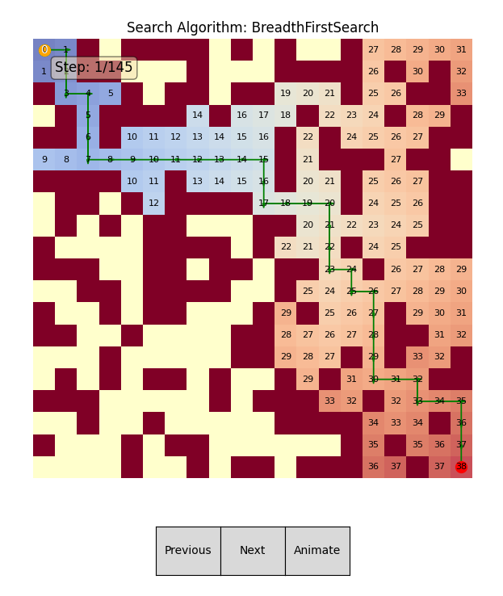

# Maze Pathfinding Algorithms

This project implements and visualizes various pathfinding algorithms in a maze environment. It includes two main Python scripts that demonstrate different approaches to maze solving.

# Forward chaining

# Graph based solver

## Files

1. `maze_solver.py`: This file contains the core implementation of the graph  traversal algorithms, including Breadth-First Search (BFS) and A* Search.

2. `forward_chaining_solver.py`: This file implements a Forward Chaining approach to maze solving, demonstrating a rule-based system for pathfinding.

## maze_solver.py

This script includes:
- A `Maze` class for representing the maze structure
- `Node` and `Step` classes for managing maze elements and search steps
- `SearchAlgorithm` abstract base class
- Implementations of BFS and A* Search algorithms
- Visualization tools for displaying the maze and search progress
- Functions for generating random mazes

Key features:
- Interactive visualization with step-by-step playback
- Options to show/hide the final path, all steps, or current steps
- Heatmap visualization of visited nodes

## forward_chaining_solver.py

This script focuses on a Forward Chaining approach to maze solving:
- Implements a knowledge-based system for maze navigation
- Uses a set of rules to make decisions about movement
- Visualizes the search process, including the agent's knowledge base
- Demonstrates fog-of-war mechanics, where the agent discovers the maze as it explores

Key features:
- Rule-based decision making
- Visualization of the agent's knowledge accumulation
- Step-by-step execution of the forward chaining process

## Usage

To run either solver:

1. Ensure you have the required libraries installed (matplotlib, numpy)
2. Run the desired script:

## Customization

Both scripts allow for customization of maze size and obstacle density. You can modify these parameters in the main execution block of each script.
